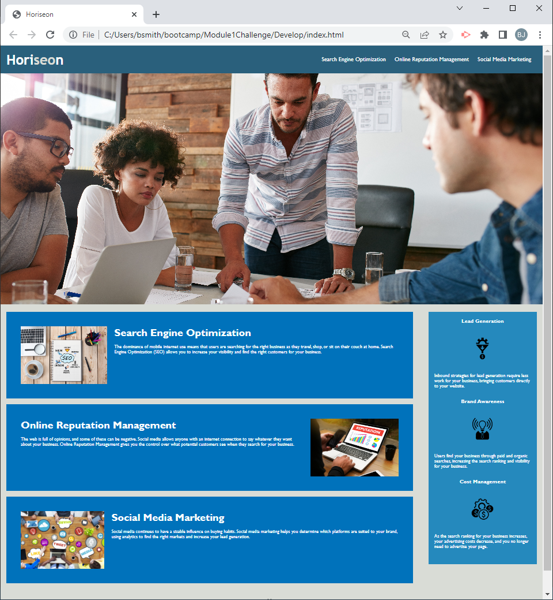

# Module 1 Challenge Webpage

## Description

This feature request challenge involves a very important aspect of web development: accessibility.  To impress clients, we should always go the extra mile and improve the codebase for long-term sustainability.  Make sure that all links are functioning correctly, reword the CSS to make it more efficient by consolidating CSS selectors and properties, organizing them to follow the semantic structure of the HTML elements, and including comments before each element or section of the page.

The User Story:

AS A marketing ageny 
I WANT A codebase that follows accessibility standards 
SO THAT our own site is optimized for search engines 

The Acceptance Criteria:

GIVEN a webpage meets accessibility standards 
WHEN I view the source code 
THEN I find semantic HTML elements 
WHEN I view the structure of the HTML elements 
THEN I find that the elements follow a logical structure independent of styling and positioning 
WHEN I view the image elements 
THEN I find accessible alt attributes 
WHEN I view the heading attributes 
THEN they fall in sequential order 
WHEN I view the title element 
THEN I find a concise, descriptive title 

### Changes made
* Fixed missing link
* Non-semantic HTML elements were replaced with semantic HTML elements.
* CSS selectors and properties are grouped together, and redundancies removed.
* Images had Alt text associated with them.
* Comments were added
* A descriptive title was added

## Installation

https://github.com/bryanjeremysmith/Module1Challenge/index.html

## Usage

## Credits

https://github.com/coding-boot-camp/urban-octo-telegram

## License

The MIT License (MIT)
=====================

Copyright © 2022 BJ Smith

Permission is hereby granted, free of charge, to any person
obtaining a copy of this software and associated documentation
files (the “Software”), to deal in the Software without
restriction, including without limitation the rights to use,
copy, modify, merge, publish, distribute, sublicense, and/or sell
copies of the Software, and to permit persons to whom the
Software is furnished to do so, subject to the following
conditions:

The above copyright notice and this permission notice shall be
included in all copies or substantial portions of the Software.

THE SOFTWARE IS PROVIDED “AS IS”, WITHOUT WARRANTY OF ANY KIND,
EXPRESS OR IMPLIED, INCLUDING BUT NOT LIMITED TO THE WARRANTIES
OF MERCHANTABILITY, FITNESS FOR A PARTICULAR PURPOSE AND
NONINFRINGEMENT. IN NO EVENT SHALL THE AUTHORS OR COPYRIGHT
HOLDERS BE LIABLE FOR ANY CLAIM, DAMAGES OR OTHER LIABILITY,
WHETHER IN AN ACTION OF CONTRACT, TORT OR OTHERWISE, ARISING
FROM, OUT OF OR IN CONNECTION WITH THE SOFTWARE OR THE USE OR
OTHER DEALINGS IN THE SOFTWARE.